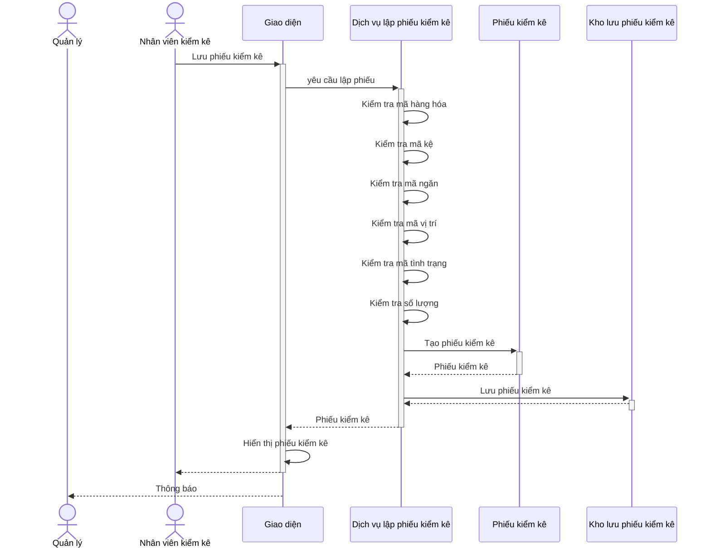

```mermaid
sequenceDiagram
    actor MA as Quản lý
    actor IA as Nhân viên kiểm kê
    participant UI as Giao diện
    participant IS as Dịch vụ lập phiếu kiểm kê
    participant IE as Phiếu kiểm kê
    participant IR as Kho lưu phiếu kiểm kê

    IA->>+UI: Lưu phiếu kiểm kê
    UI->>+IS: yêu cầu lập phiếu
    IS->>IS: Kiểm tra mã hàng hóa
    IS->>IS: Kiểm tra mã kệ
    IS->>IS: Kiểm tra mã ngăn
    IS->>IS: Kiểm tra mã vị trí
    IS->>IS: Kiểm tra mã tình trạng
    IS->>IS: Kiểm tra số lượng
    IS->>+IE: Tạo phiếu kiểm kê
    IE-->>-IS: Phiếu kiểm kê
    IS->>+IR: Lưu phiếu kiểm kê
    IR-->>-IS:
    IS-->>-UI: Phiếu kiểm kê
    UI->>UI: Hiển thị phiếu kiểm kê
    UI-->>-IA:
    UI-->>MA: Thông báo
```
