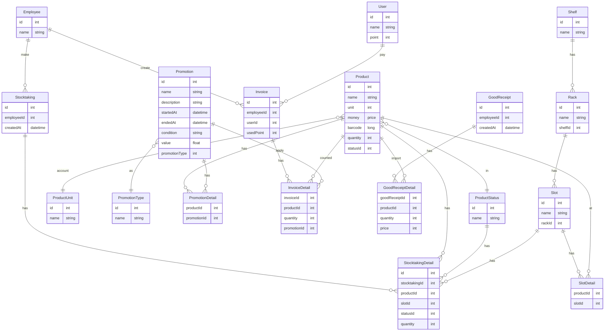

```mermaid
erDiagram
    Product {
        id int
        name string
        unit int
        money price
        barcode long
        quantity int
        statusId int
    }

    ProductStatus {
        id int
        name string
    }

    ProductUnit {
        id int
        name string
    }

    PromotionType {
        id int
        name string
    }

    Promotion {
        id int
        name string
        description string
        startedAt datetime
        endedAt datetime
        condition string
        value float
        promotionType int
    }

    PromotionDetail {
        productId int
        promotionId int
    }

    Invoice {
        id int
        employeeId int
        userId int
        usedPoint int
    }

    InvoiceDetail {
        invoiceId int
        productId int
        quantity int
        promotionId int
    }

    User {
        id int
        name string   
        point int     
    }

    Employee {
        id int
        name string
    }

    GoodReceipt {
        id int
        employeeId int
        createdAt datetime        
    }

    GoodReceiptDetail {
        goodReceiptId int
        productId int
        quantity int
        price int
    }

    Stocktaking {
        id int
        employeeId int
        createdAt datetime
    }

    StocktakingDetail {
        id int
        stocktakingId int
        productId int
        slotId int
        statusId int
        quantity int
    }

    Shelf {
        id int
        name string
    }

    Rack {
        id int
        name string
        shelfId int
    }

    Slot {
        id int
        name string
        rackId int
    }

    SlotDetail {
        productId int
        slotId int
    }

    Product }o--|| ProductUnit: account
    Promotion }o--|| PromotionType: as
    Product ||--o{ PromotionDetail: has
    Promotion ||--o{ PromotionDetail: has
    Employee ||--o{ Invoice: create
    User ||--o{ Invoice: pay
    Invoice ||--o{ InvoiceDetail: has
    Product ||--o{ InvoiceDetail: counted
    Promotion ||--o{ InvoiceDetail: apply
    GoodReceipt ||--o{ GoodReceiptDetail: has
    Product ||--o{ GoodReceiptDetail: import
    Shelf ||--o{ Rack: has
    Rack ||--o{ Slot: has
    Slot ||--o{ SlotDetail: has
    Product ||--o{ SlotDetail: at
    Employee ||--o{ Stocktaking: make
    Stocktaking ||--o{ StocktakingDetail: has
    Product ||--o{ StocktakingDetail: has
    ProductStatus ||--o{ StocktakingDetail: has
    Slot ||--o{ StocktakingDetail: has
    Product }o--|| ProductStatus: in
```
